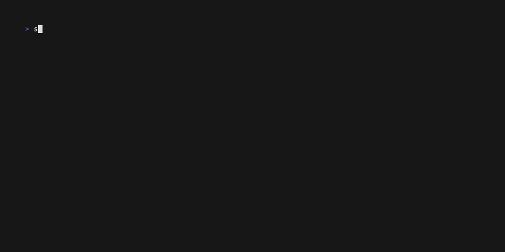

# spotify-setlist

Create a Spotify playlist from an artist's live setlist.

## Description

Spotify Setlist is a command-line tool that helps you create Spotify playlists based on live setlists from setlist.fm.
The created playlist allow you to easily explore an artist's live repertoire, or relive the experience of a specific
concert.



## Installation

### Prerequisites

- [Go 1.25.3+](https://golang.org/doc/install)
- Spotify account
- Setlist.fm account

### Install from Source

```bash
go install github.com/michaelheyman/spotify-setlist@latest
```

The binary will be installed to `$GOPATH/bin/spotify-setlist` (usually `~/go/bin/spotify-setlist`).

Make sure `$GOPATH/bin` is in your `$PATH`:

```bash
export PATH=$PATH:$(go env GOPATH)/bin
```

## Configuration

The CLI tool requires authorized access to both Spotify and setlist.fm APIs. Follow the steps below to obtain the necessary
credentials and configure the application.

### API Credentials

#### Spotify

1. Go to [Spotify Developer Dashboard](https://developer.spotify.com/dashboard)
1. Log in with your Spotify account (create one if needed)
1. Create a new application
1. Copy your Client ID and Client Secret
1. In your app settings, add `http://127.0.0.1:8080/callback` as a Redirect URI

> **Note:** Spotify requires loopback redirect URIs to use an explicit IP address (`127.0.0.1`) rather than `localhost`. Apps created after April 9, 2025 enforce this — using `http://localhost` will result in a "redirect_uri: Insecure" error.

#### Setlist.fm

1. Go to [Setlist.fm](https://www.setlist.fm/)
1. Create an account or log in
1. Visit [Setlist.fm API](https://www.setlist.fm/settings/apps)
1. Copy your API key

You will have to request an API rate limit upgrade to use the API key with this application, since the default rate limit is too low. You need the second rate tier, which allows for 16 request per second and max 50000 a day.

### Setup

#### Via Environment Variables

Create a `.env` file in your project directory or set the following environment variables:

```bash
export SPOTIFY_CLIENT_ID="your_spotify_client_id"
export SPOTIFY_CLIENT_SECRET="your_spotify_client_secret"
export SPOTIFY_REDIRECT_URI="http://127.0.0.1:8080/callback"
export SETLIST_FM_API_KEY="your_setlist_fm_api_key"
```

#### Via Configuration File

Alternatively, create a `~/.spotify-setlist.yaml` file in your home directory:

```yaml
spotify_client_id: "your_spotify_client_id"
spotify_client_secret: "your_spotify_client_secret"
spotify_redirect_uri: "http://127.0.0.1:8080/callback"
setlist_fm_api_key: "your_setlist_fm_api_key"
```

You can also specify a custom config file location:

```bash
spotify-setlist --config /path/to/config.yaml create-playlist
```

## Usage

### Create a Playlist

```bash
spotify-setlist create-playlist --artist 'The Beatles'
```

The command will prompt you to authenticate with Spotify to grant it permission to create playlists on your behalf. It
will then create the playlist based on the setlist it retrieves from setlist.fm.

Subsequent executions will use the saved refresh token, so you won't need to authenticate again unless the token has
expired.

### Options

- `--config` - Path to a config file
- `-v, --verbose` - Enable verbose output for debugging
- `-h, --help` - Show help message

## Development

### Running Tests

```bash
task test
```

### Code Quality

Format code:

```bash
task fmt
```

Run linter:

```bash
task lint
```
